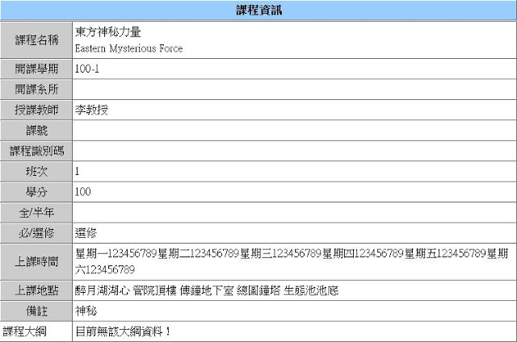
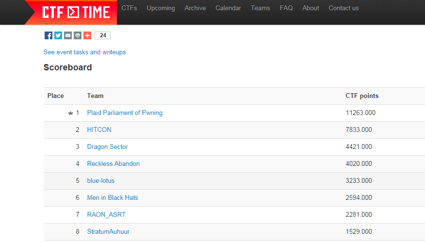

---
title: COMPUTER SECURITY
subtitle: 計算機安全
---

# 本日任務

## 本日任務

+ 講解課程內容
+ 作業、評分標準
+ 加簽
+ 把人嚇跑

## Warning

+ 不是正規的資安課
+ 計算機結構、網路的內容很多
+ 作業頗重

# 講師介紹

## 

## 

<table>
<tr><td>

</td><td style="vertical-align:middle">
+ 吳哲仰 (Sean)
+ 台大資工碩二
+ Team [217](http://217.logdown.com/)
+ Software security
</td></tr>
</table>

##

<table>
<tr><td>

</td><td style="vertical-align:middle">
+ 陳庭緯 (Shik)
+ 台大資工碩一
+ Team [217](http://217.logdown.com/)
+ Cryptography
</td></tr>
</table>

##

<table>
<tr><td>

</td><td style="vertical-align:middle">
+ 蔡政達 (Orange)
+ ~~天大地大~~台科大碩一
+ [Blog](http://blog.orange.tw/)
+ Web security
</td></tr>
</table>

# 課程目標

## 遠大的目標

+ 了解到 Bug 無所不在，之後能少寫一點
+ 實作攻擊技術 ~~攻擊是最好的防禦~~
+ DEFCON 預備軍

## Epic Fail

~~~~ {.cpp}
        OSStatus        err;
        ...

        if ((err = SSLHashSHA1.update(&hashCtx, &serverRandom)) != 0)
                goto fail;
        if ((err = SSLHashSHA1.update(&hashCtx, &signedParams)) != 0)
                goto fail;
                goto fail;
        if ((err = SSLHashSHA1.final(&hashCtx, &hashOut)) != 0)
                goto fail;
        ...

fail:
        SSLFreeBuffer(&signedHashes);
        SSLFreeBuffer(&hashCtx);
        return err;
~~~~

## 

## 東方神祕力量

## Misc

+ Plugin 外掛
+ Driver 逆向工程
+ Android ROOT, iOS Jailbreak

# START HACKING

## Hacker
+ *對電腦科學、編程和設計方面具高度理解的人*
+ *熱衷於研究系統和計算機 (特別是網路) 內部運作的人*

## 本課程範圍
+ Software security
+ Web security
+ Cryptography
+ 各種 geek skills

## Software Security
+ Control-flow hijack
+ Information leakage
+ Logical vulnerability

## Web Security
+ Web server side vulnerabilities
+ features & vulnerabilities
+ Injection flaw

## Cryptography
+ Classical cipher & crack
+ Public-key cryptography
+ Hash
+ [密碼學專題](https://ceiba.ntu.edu.tw/1031Crypto)超濃縮版

# HACK THE SERVICE

## Control-flow Hijack
+ 利用 (exploit) 漏洞 (vulnerability) 控制程式本身，做出非原本預期的行為
+ 利用 buffer overflow 蓋掉..
    + Return address, function pointer, vtable, etc.
    + 跳到 shellcode 上執行
+ Format string attack
    + 任意讀取、寫入，一樣可以控制程式流程

## Shellcode
+ 現在主流的計算機架構中，data 和 code 都是混在一起的
+ 適當的 data 也可以當 code 跑
+ 基本上就是 assembler 生成的 binary code

## 對應 defense
+ Stack overflow &#8594; Stack guard
    + Heap 在 GLIBC 裡的保護現在是一坨屎
+ 「跳」到想要執行的位址 &#8594; ASLR
+ 執行任意 shellcode &#8594; DEP/NX bit
+ 讓 exploit 難度增加，漏洞便不成破綻

## Stack guard
+ 進 function 時先放個渣渣在 stack frame 最高處
+ Return 前檢查有沒有被蓋掉
+ 如果可以先洩漏出渣渣的值就可以騙過檢查

~~~~ {.no-highlight}

Low address                                                 High address
          callee                            caller
         |---------------------------------|----------------------------
               Buffer                Canary
               AAAAAAAAAAAAAAAAA .....

~~~~

Stack Layout

## ASLR
+ 位址空間配置隨機載入
+ Code, data, shared-library 的位址每次執行會變
    + Try `int a; printf("%p", &a);` 
+ 有機會洩漏位址 (information leakage)
+ 且不一定要拿到 base address 也有辦法跳到正確位址上

## DEP/NX bit
+ 不能執行 shellcode，那就執行原本正常功能的 code
    + ret2text
    + ret2libc
+ 返回導向程式設計 (ROP)

# CAPTURE THE FLAG

## Capture The Flag
+ ACM-ICPC 之於**程式結構與設計**
+ KDD Cup 之於**機器學習理論與實務**
+ CTF 是比 hacking 技術的比賽

## Flag 型式
+ 通常是個明顯的字串，submit 後可獲得一定分數
+ 放在 server 上，想辦法利用服務的漏洞拿到
+ 密文要加密
+ 側錄到的封包、特殊的檔案系統

## Jeopardy

+ 解題比賽
+ 24 ~ 48 小時，比時限內得分
+ 帶有漏洞的 service；可破解的 encryption
+ 入侵或破解後就有辦法拿到 flag

## Attack-defense

+ 每隊會拿到帶有漏洞的 service
+ 除了互相攻擊外，也可以修補自己的 service
+ Flag 每回合更新
+ 攻擊成功則得分，被攻擊方會失分

## Our CTF Team
+ 217
    + 百度杯 - 1st Place
+ HITCON
    + Defcon - 2nd Place
+ 很多 online jeopardy 競賽

##

##

## Our CTF game

## 人才招募
+ 台灣玩 CTF 的人很少，這次去 Defcon 的有 15 人
+ 國外強隊有幾十人在 Defcon 外場 & 幾十人遠端同步進行
+ 人數就是力量

# 評分標準

## 評分標準
+ ~~起分 60 分的零和 Attack-defense (100%)~~

. . . 

+ 個人作業 (40%)
+ 團體作業 (30%)
+ 期末考 (30%)
+ 額外加分

## 個人作業

+ Weekly
+ 與當次上課內容相關
+ 可討論，但需獨立完成

## 團體作業

+ Bi-weekly
+ 每組只需繳交一份
+ 過去 online CTF 題目
+ 早點開始分組比較好，每組限定 &#8804; 5人

## 期末考

+ 可能是個 Attack-defense
+ Report 佔大部份分數
+ 可能和交大合辦

## 額外加分

+ 課堂表現
+ [CTFtime.org](https://ctftime.org) or 其它比賽

# 加簽方式

## 取得授權碼
+ 完成 [Homework 0x00](https://csie.ctf.tw/)
+ 完成某個指定題 (TBD)
+ 一直盧
+ ~~自助式加簽~~
+ ~~物理攻擊~~

# 聯絡助教

## IRC

## irssi
+ /connect irc.freenode.net
+ /join csie-ctf
+ /m someone something
+ Alt + num 切換視窗
+ /wc 關閉視窗
+ /quit (理論上用不到)

## Mail 
+ ctf@csie.ntu.edu.tw

## Office Hour
+ 另約時間
+ 高機率出現在 R217

# NEXT WEEK

## Execution on x86 Linux
+ Assembly
+ ELF binary format
+ Calling convention 

## 預備技能 & Tools
+ gdb
+ readelf 
+ objdump
+ IDA
+ binary patching
+ scripting

## gdb
+ set disassembly-flavor intel
+ r, b, c, k, q
+ at
+ n, s, ni, si
+ p, x/bx, x/wx, x/gx, x/s
+ layout asm, layout reg
+ info
+ record, record stop, rc, rni, rsi

## readelf & objdump
+ readelf -a
+ objdump -M intel -D 

## IDA

[Hex-Rays IDA Pro](https://www.hex-rays.com/products/ida/support/download.shtml)

## Binary Patching
+ vim + %!xxd
+ [ht](http://hte.sourceforge.net/) 
+ hexedit

## Scripting
+ Exploit 要寫 script
+ 能接 socket
+ 好做字串處理
+ 推薦 Python or Ruby

# Q&A

