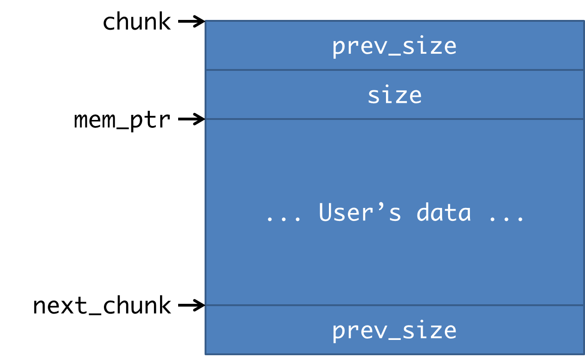
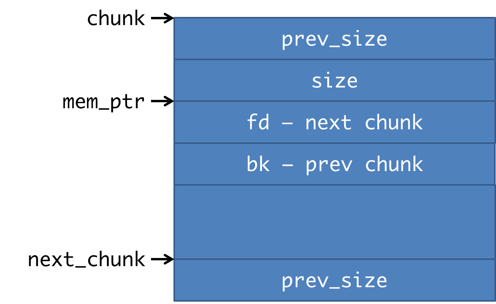
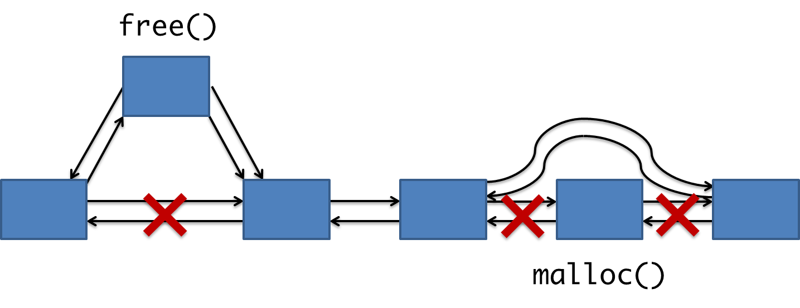
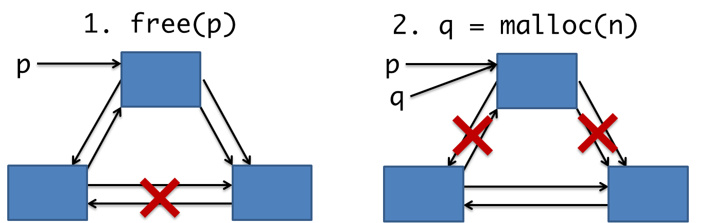
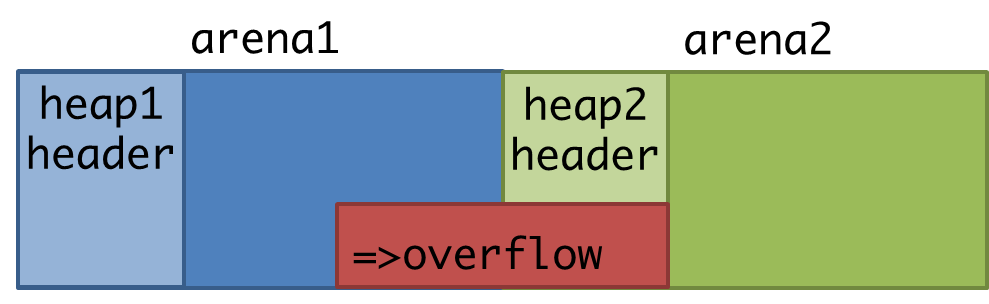

---
title: Break the Heap
---

# GLibc Heap

## What's Heap

+ C Library 裡動態配置記憶體的一種方法
+ `malloc()`, `free()`
+ 記憶體的配置、釋放，由 libc 內部實作

## GNU Libc Source
+ [glibc/malloc/malloc.c](http://code.woboq.org/userspace/glibc/malloc/malloc.c.html)
+ 複雜無比

## Overview
+ Heap 管理配置出來的記憶體
+ `free` 掉的片段會被收集起來，之後可以再次給 `malloc` 使用
+ 使用 linked list 管理這些片段

## Functions
+ `malloc` &#8594; `__libc_malloc` &#8594; `_int_malloc`
+ `free` &#8594; `__libc_free` &#8594; `_int_free`

## Doug Lea's malloc    
+ 配置的記憶體 + info = **chunk**
+ 用多個 linked list 記錄可用的 chunk，每個 list 的 head 為一個 **bin**
+ Libc 裡是 ptmalloc，是基於 dlmalloc 實作的

## Chunk
+ 配置記憶體的單位為 chunk

``` cpp
struct malloc_chunk {
 
  INTERNAL_SIZE_T      prev_size;  /* 前一個 chunk size */
  INTERNAL_SIZE_T      size;       /* 本 chunk size */
 
  struct malloc_chunk* fd;         
  struct malloc_chunk* bk;
 
  struct malloc_chunk* fd_nextsize; 
  struct malloc_chunk* bk_nextsize;
};
```

## Chunk (inuse)


## Chunk (inuse)
+ `mem_ptr` 是 malloc 回傳的指標，可以使用的記憶體位置
+ malloc 時指定的大小為 `sz`，會得到一個大小為 `((sz + 7) & 7) + 8` 的 chunk
+ chunk 的大小和對齊位置皆為 8 的倍數

## Chunk (freed)


## Chunk (freed)
+ `fd` **不是指向 next_chunk**，是在 free-chunk list 裡的下一個 chunk
+ `bk` 是 list 裡的上一個 chunk

## malloc & free
+ malloc 從 list 裡拿出可用的 chunk；free 時放回 list


## brk()
+ malloc 時 list 裡不一定有可以用的 chunk
    + 還沒有 freed chunk
    + list 裡的 chunk 都不夠大
+ malloc 中會使用 `brk()` 增加 data segment 的大小，然後配置新的 chunk
+ 原則上，**chunk 在記憶體中是連續的**
    + 因此一個 chunk 上的溢出有可能會寫到下一個 chunk

## 合併 free chunk
+ 為了避免太多破碎的 chunk，如果 freed chunk 在記憶體中是連續的，則合併起來
+ free 時檢查前後兩個 chunk 是不是 inuse，若否則可合併

## Size
+ Size 是 8-bytes 對齊，最低的 3 bits 有特殊用途
    + `PREV_INUSE 0x1` 前一個 chunk 是使用中 (非 freed)
    + `IS_MMAPPED 0x2` 這個 chunk 是用 mmap() 建立的
    + `NON_MAIN_ARENA 0x4` 這個 chunk 所在的 heap 是不是在 main_arena 內

## 合併 free chunk
+ 檢查 `me->size & PREV_INUSE`，前一個 chunk 
+ 檢查 `(next + nextsize)->size & PREV_INUSE`，後一個 chunk

## 合併 free chunk
``` cpp
/* consolidate backward */
if (!prev_inuse(p)) {
  prevsize = p->prev_size;
  size += prevsize;
  p = chunk_at_offset(p, -((long) prevsize)); /* 前一個 chunk */
  unlink(p, bck, fwd);
}

if (nextchunk != av->top) {
  /* get and clear inuse bit */
  nextinuse = inuse_bit_at_offset(nextchunk, nextsize); 
  /* consolidate forward */
  if (!nextinuse) {
    unlink(nextchunk, bck, fwd);
    size += nextsize;
  }
```

## unlink()
+ 從 linked list 裡移除一個 chunk

``` no-highlight
#define unlink(P, BK, FD) {                                   \
  FD = P->fd;                                                 \
  BK = P->bk;                                                 \
  FD->bk = BK;                                                \
  BK->fd = FD;                                                \
}
```

## malloc_state

``` cpp
struct malloc_state 
{
  mutex_t mutex;
  int flags;                        /* =max_fast */
  mfastbinptr fastbinsY[NFASTBINS]; /* fastbins */
  mchunkptr top;                    /* topchunk */
  mchunkptr last_remainder;         /* spliting remains */
 
  mchunkptr bins[NBINS * 2 - 2];    /* normal bins */
  unsigned int binmap[BINMAPSIZE];
 
  struct malloc_state *next;
  struct malloc_state *next_free;
  INTERNAL_SIZE_T system_mem;
  INTERNAL_SIZE_T max_system_mem;
};
```

## malloc_state
+ 用來儲存 heap 當前的狀態
+ **Bins** &mdash; heads of linked lists

## Bins
+ 用來記住 linked list 的 head
+ glibc 實作裡，bins 分為三種
    + fastbin
    + smallbin
    + largebin
+ 目的: malloc 時可以快速找到大小適合的 chunk

## malloc 原則
+ 照以下順序在 bin 裡尋找可用的 chunk，每種 bin 有各自的使用限制
    + fastbin: size &#8804; max_fast (default: 64)
    + smallbin: size &#8804; 512B
    + largebin: size &#8804; 128KiB

## malloc 原則
+ 如果都沒有可用的 chunk，[use_top](http://code.woboq.org/userspace/glibc/malloc/malloc.c.html#3738) 裡使用 top_chunk
+ 例外: size > 128 * 1024 bytes
    + 直接用 `mmap()` 配置需要的大小
    + 這時 size 的 IS_MMAPPED bit 被設為 1

## Fastbin 
+ Free chunk 時，如果 chunk size <= 72，會被放進 fastbin
+ `fastbin_index = (size >> 3) - 2`
+ 不取消 INUSE bit，即不參與 freed chunk 的合併
+ Singly linked list

``` cpp
idx = fastbin_index(size);
fb = &fastbin (av, idx);
p->fd = *fb;
*fb = p;
```

## Fastbin 
+ malloc 時直接拿 bin 裡的第一個
+ LIFO (last in, first out) 

``` cpp
idx = fastbin_index (nb);
fb = &fastbin (av, idx);
victim = fb->fd;
fb->fd = victim->fd;
return victim;
```

## Smallbin
+ size <= 512 時，使用 smallbin
+ 為 normal bins 中前 64 (512/8) 個
+ 每種 size 有對應的 bin，每個 bin 中存的 chunk 大小都相同 (用 double linked list 維護)
+ malloc 時先找對應的 bin 裡有沒有可用的 chunk

## Largebin
+ chunk size > 512 時，會被放進 largebin
+ `largebin_index_32(sz)`
+ 大約是指數遞增的 bin range

``` no-highlight
64 bins of spacing size 8
32 bins of spacing size 64
16 bins of spacing size 512
 8 bins of spacing size 4096
 4 bins of spacing size 32768
 2 bins of spacing size 262144
 1 bin  of spacing size what's left
```

## Largebin
+ 因為 bin 裡的 chunk 大小不一，用 sorted list 存
+ chunk 由小到大排列
+ `fd_nextsize`, `bk_nextsize` 指向下一個大小不同的 chunk，用來加快 search

## Unsorted bin
+ free chunk 後，chunk 並不會立刻放進正確的 bin (fastbin 除外)，而是放進 unsorted bin: `bin[1]`
    + 整理的時間太長
    + 有可能被合併，合併後還會再被移出 bin，等於做白工
+ unsorted bin 在 malloc 「找不到恰好符合的 chunk」時，進行整理

## Best Fit Chunk
+ malloc 時有可能沒有大小剛好的 chunk
+ 整理一下 unsorted bin，如果有剛好 fit 的就順手拿走
+ 否則之後再依序掃描 normal bins，找到最小可用 chunk

## Top Chunk
+ 記憶體中位置最大的 chunk
+ 可以任意調整大小，因為其後沒有別的 chunk 了
+ 在沒有夠大的 free chunk 可以用時，會使用 top chunk
+ Top chunk 縮小時，多出的部份會成為新的 top chunk

## Last Remainder
+ Free chunk 被重新拿出來使用時，如果 chunk size 比 request size 大會 split 成兩個 chunk
+ Realloc 時也有可能 split chunk
+ last_remainder 記錄前一次 split 後剩下的部份
+ malloc 在沒有大小剛好的 chunk 時，會先檢查 last_remainder 夠不夠大
    + 如果足夠則會切下一部份，剩下的成為新的 last_remainder
    + 是對連續小塊 malloc 所做的優化


# Break the Heap

## Review: Stack Buffer Overflow
+ Target 是 local variable (array)
+ 可以直接蓋掉 return address，控制 flow
+ 可能有 stack guard，可能要先有某些 information leaking

## Heap Overflow
+ Target 是 malloc 得到的 buffer
+ 例如: malloc(100) 但寫入超過 100 bytes
+ 無法直接蓋到 return address 或 GOT

## Idea
+ 維護 Heap 的各種 structures、meta-data 是和 buffer 放在一起的
+ 寫掉這些 structure，之後再使用 malloc 或 free 等操作時，有辦法再寫入其它地方
+ 有可能不需要任何 information leaking
+ 但新的 glibc 裡有各種檢查，需要想辦法繞過

## Example (fake)

``` cpp
#include <stdio.h>
#include <stdlib.h>

int main(int argc, char **argv) {
  char *p, *q;
  p = malloc(256);
  q = malloc(256);
  gets(p);
  free(q);
  free(p);
  return 0;
}
```

## Results

``` no-highlight
$ perl -e 'print "A"x256,"AAAAAAAAAAAAAAA"' | ltrace ./example
__libc_start_main(0x804847d, 1, 0xffffdc64, 0x80484e0 <unfinished ...>
malloc(256) = 0x804b008
malloc(256) = 0x804b110
gets(0x804b008, 0xffffdc64, 0xffffdc6c, 0xf7e5e39d) = 0x804b008
free(0x804b110 <no return ...>
--- SIGSEGV (Segmentation fault) ---
+++ killed by SIGSEGV +++
```

## SIGSEGV in free()

+ 下個 chunk 的 size 被蓋掉 (=0x41414140) 
+ nextchunk 的位置不正確 (=0x804b108+0x41414140)
+ nextsize = nextchunk->size 時 segmentation fault

```
nextchunk = chunk_at_offset(p, size);
nextsize = chunksize(nextchunk);
```

## Next step
+ 覆蓋正確的 size，使得 nextchunk 落在可控制範圍
+ 控制好正確的 prevsize

```
/* consolidate backward */
if (!prev_inuse(p)) {
  prevsize = p->prev_size;
  size += prevsize;
  p = chunk_at_offset(p, -((long) prevsize));
  unlink(p, bck, fwd);
}
```

## Exploit unlink()
+ 傳入 `unlink(p)` 的 chunk p，內容是可以控制的
+ 利用 `FD->bk = BK` 和 `BK->fd = FD`，可以同時寫入兩個目標

``` no-highlight
#define unlink(P, BK, FD) {                                   \
  FD = P->fd;                                                 \
  BK = P->bk;                                                 \
  FD->bk = BK;                                                \
  BK->fd = FD;                                                \
}
```

## Exploit unlink()
+ 控制 P 的內容
    + `FD = P->fd = free_GOT - 12`
    + `BK = P->bk = shellcode`

``` no-highlight
#define unlink(P, BK, FD) {                                   \
  FD = P->fd;                                                 \
  BK = P->bk;                                                 \
  FD->bk = BK;                                                \
  BK->fd = FD;                                                \
}

struct malloc_chunk {
  INTERNAL_SIZE_T      prev_size; 
  INTERNAL_SIZE_T      size;       
  struct malloc_chunk* fd;         
  struct malloc_chunk* bk;
}

```

## Exploit unlink()
+ 寫掉 free_GOT `FD->bk = *(FD + 12) = *free_GOT = shellcode`
+ 也會破壞一部份 shellcode[8:12]: `BK->fd = FD`

``` no-highlight
#define unlink(P, BK, FD) {                                   \
  FD = P->fd;                                                 \
  BK = P->bk;                                                 \
  FD->bk = BK;                                                \
  BK->fd = FD;                                                \
}

struct malloc_chunk {
  INTERNAL_SIZE_T      prev_size; 
  INTERNAL_SIZE_T      size;       
  struct malloc_chunk* fd;         
  struct malloc_chunk* bk;
}

```

## Exploit unlink()
+ 之後 free(p) 時，就會變成跳到 shellcode
+ shellcode 可以放在 p 上，ASLR 沒全開時，heap 的位置是固定的
+ shellcode 有 4 個 bytes 會被破壞，但可以用 jmp 跳過

``` cpp
#include <stdio.h>
#include <stdlib.h>

int main(int argc, char **argv) {
  char *p, *q;
  p = malloc(256);
  q = malloc(256);
  gets(p);
  free(q);
  free(p);
  return 0;
}
```

## The Truth
``` no-highlight
#define unlink(P, BK, FD) {                                \
  FD = P->fd;                                              \
  BK = P->bk;                                              \
  if (FD->bk != P || BK->fd != P)                          \
    malloc_printerr (check_action, "corrupted d...", P);   \
  else {                                                   \
    FD->bk = BK;                                           \
    BK->fd = FD;                                           \
  }                                                        \
}
```

## Hardened unlink()
+ 較新的 glibc (>2.3.5) 中增加了很多檢查
+ `P->fd->bk` 和 `P->bk->fd` 必須指回 `P` (因為是 double linked list)
+ 但沒道理可以先控制好這兩個 pointer 的值... <br>如果可以，表示已經能對 target 任意寫入了


# Use After Free

## Use After Free

+ 相對簡單，而且能有效的利用
+ 根據 "use" 的方法，有機會造成任意讀取、寫入，或再一次 buffer overflow
+ 條件
    + free 掉某個 pointer p 之後，p 還會被繼續使用
    + free 後可執行一個可控大小的 malloc

## Idea
+ 被 free 掉的 chunk 會被放進對應的 bin
+ 之後 malloc 如果要求一樣大小 (或小一點) 的 chunk，就會被拿出來
+ 這時兩個 pointer 會指向同一塊記憶體，交互作用下會造成其它問題



## Practice

[Binary & Source](src/prison.tar.gz)

## Vulnerability

+ 存在某個 use after free 漏洞，where?

## malloc
+ 如何 malloc? Size 應該要是多少?
+ 造成的結果?

## 利用 collision 的指標
+ 任意讀取?
+ 任意寫入?

## GOT hijack
+ Which?

# The Malloc Maleficarum

## Reference

[The Malloc Maleficarum](http://packetstormsecurity.com/files/view/40638/MallocMaleficarum.txt)

## Malloc Exploitation Techniques
+ The House of Prime
+ The House of Mind
+ The House of Force
+ The House of Lore
+ The House of Spirit

## The House of Prime

+ 條件: 兩次可控大小的 free()，一次 malloc()
+ 目前的 glibc 版本已經無法使用

## Step1: 改大 max_fast
+ `free(p)` 一個大小為 8 的 chunk，chunk size 可能是由之前的 heap overflow 造成的
+ 根據 `fastbin_index(8)`，這個 chunk 會被放進 `fastbins[-1]`
+ 但這個位置其實是 `max_fast`，會把它改成 `p`，一個很大的數值

``` cpp
...
INTERNAL_SIZE_T  max_fast;
mfastbinptr      fastbins[NFASTBINS];
mchunkptr        top;
...

#define fastbin_index(sz)    ((((unsigned int)(sz)) >> 3) - 2)
```

## Step2: 改寫 arena_key
+ 由於 `max_fast` 被改大了，之後所有操作都會進到 fastbin
+ free 一個特定大小的 chunk，把 `p` 寫到 `arena_key` 上
+ 下面的例子中，正確的 size 為 `(0x484/4 + 2) * 8 = 2383`

``` no-highlight
0xb7f00000 <main_arena>:        0x00000000
0xb7f00004 <main_arena+4>:      0x00000049   <-- max_fast
0xb7f00008 <main_arena+8>:      0x00000000   <-- fastbin[0]
0xb7f0000c <main_arena+12>:     0x00000000   <-- fastbin[1]
....
0xb7f00488 <mp_+40>:            0x0804a000   <-- mp_.sbrk_base
0xb7f0048c <arena_key>:         0xb7f00000
```

## Step3-1: 使 malloc 回傳任意位址
+ Step2 中被 free 的 chunk，會成為新的 heap arena，即 chunk 中的內容會被當做 heap 來操作
+ 預先在 chunk 的 fastbin 欄位放好某個想要得到的位址，利如: stack, GOT
+ malloc (fastbin) 會把這個位址回傳，之後可以直接對這個位址讀寫
+ malloc size 需要夠小，才有辦法預先放上 fastbin entry

## Step3-2: 使用 malloc 寫入任意位址
+ 當 malloc size > 512 時，可以利用 unsorted_chunks
+ 構造 `av->bins[1]` 指向 `A`，可以把 `*(A->bk->bk+8)` <br>寫為 `A`
+ 也可以回傳 `A->bk`，之後再寫入

``` cpp
for(;;) {
  while ( (victim = unsorted_chunks(av)->bk) !=
    unsorted_chunks(av)) {
      bck = victim->bk;
      ...
      size = chunksize(victim);
      ...
      unsorted_chunks(av)->bk = bck;
      bck->fd = unsorted_chunks(av);
      if (size == nb) {
        ...
        return chunk2mem(victim);
      }
```

## The House of Mind

+ 有可能只需要一次 free
+ 條件: `ar_ptr` 必需要是下一個 arena

```
public_fREe(Void_t* mem)
{
    mstate ar_ptr;
    mchunkptr p;        /* chunk corresponding to mem */
    ...
    p = mem2chunk(mem);
    ...
    ar_ptr = arena_for_chunk(p);
    ...
    _int_free(ar_ptr, mem);
```

## Arena
+ Heap 的大小有限制 (1M)，如果超過了會建立一個新的 
+ 假設原 heap1 在 arena1，malloc 夠多的記憶體後，會在 arena2 開一個新的 heap2
+ arena1 和 arena2 在記憶體上的位置是連續的

## Overflow
+ 在 arena1 中的 chunk 有 overflow
+ 這個 overflow 有辦法超過 arena1 的邊界，寫到 arena2
+ 結果是**寫掉 heap2 的 meta-data**



## Exploit Method 1
+ 最終要利用的 [code](http://code.woboq.org/userspace/glibc/malloc/malloc.c.html#3599) 
片段類似 unlink()，但沒有 harden
+ 跟 House of Prime 類似，整個 heap 結構在控制之下
+ `free(p)` 後能到達底下這段 code (`p` 是 arena2 裡的 chunk)
+ 一樣需控制 `bins[1]`，即 unsorted_chunks

``` cpp
bck = unsorted_chunks(av);
fwd = bck->fd;
p->bk = bck;
p->fd = fwd;
bck->fd = p;
fwd->bk = p;
```

## 大量需繞過的條件
- The negative of the size of the overflowed chunk must
 be less than the value of the chunk itself.
- The size of the chunk must not be less than max_fast.
- The IS_MMAPPED bit of the size cannot be set.
- The overflowed chunk cannot equal av->top.
- The NONCONTIGUOUS_BIT of max_fast must be set.
- The PREV_INUSE bit of the nextchunk must be set.
- The size of nextchunk must be greater than 8.
- The size of nextchunk must be less than system_mem
- The PREV_INUSE bit of the chunk must not be set.
- The nextchunk cannot equal av->top.
- The PREV_INUSE bit of the chunk after nextchunk must be set

## Exploit Method 2
+ 使用 fastbin，`*fb = p` 做寫入
+ 例如 `*(GOT_entry) = shellcode`
+ 要注意的條件只有 `p->size`

``` cpp
if ((unsigned long)(size) <= (unsigned long)(av->max_fast)) {
  if (chunk_at_offset (p, size)->size <= 2 * SIZE_SZ
     || __builtin_expect (chunksize (chunk_at_offset (p, size))
                             >= av->system_mem, 0)) {
      errstr = "free(): invalid next size (fast)";
      goto errout;
    }

  set_fastchunks(av);
  fb = &(av->fastbins[fastbin_index(size)]);
  ...
  p->fd = *fb;
  *fb = p;
}
```

## House of Force
+ 使用兩次 malloc，第二次 malloc 回傳任意位址
+ 第一次 malloc 的大小需可控制
+ 第二次 malloc 要足夠大

## Idea
+ 利用 malloc 裡的 use_top 片段
+ 要能 overflow 到 top_chunk

``` cpp
use_top:
  victim = av->top;
  size = chunksize(victim);
  if ((unsigned long)(size) >= (unsigned long)(nb + MINSIZE)) {
    remainder_size = size - nb;
    remainder = chunk_at_offset(victim, nb);
    av->top = remainder;
    set_head(victim, nb | PREV_INUSE |
             (av != &main_arena ? NON_MAIN_ARENA : 0));
    set_head(remainder, remainder_size | PREV_INUSE);
    check_malloced_chunk(av, victim, nb);
    return chunk2mem(victim);
  }
```

## Step 0
+ 先 overflow 掉 top_chunk 的 size，改成一個夠大的值
+ 確保任何大小的 malloc 都可以使用 top_chunk

## Step 1
+ malloc(nb)，如果 nb 大小可以控制，最後可以控制 `av->top` 所指的位置 
+ `av->top` 是 top_chunk 所在位置

``` cpp
    remainder_size = size - nb;
    remainder = chunk_at_offset(victim, nb);
    av->top = remainder;
```

## Step 2
+ 第二次 malloc，會回傳 Step 1 控制的 `av->top` 
+ 取得任意位址的 pointer，可以再進行寫入

``` cpp
  victim = av->top;
    ...
    return chunk2mem(victim);
```

## The House of Lord
+ 同 House of Force，只需要多次的 malloc
+ 使用 [smallbin](http://code.woboq.org/userspace/glibc/malloc/malloc.c.html#3366)
+ 或 chunk searching 裡的 [largebin](http://code.woboq.org/userspace/glibc/malloc/malloc.c.html#3669)

## Idea: Corrupting a Bin
+ Overflow 修改一個在 smallbin 裡的 chunk (freed)
+ 改掉這個 chunk 的 bk，變成想要取得的 target 位址

``` cpp
    if (in_smallbin_range(nb)) {
      idx = smallbin_index(nb);
      bin = bin_at(av,idx);
      if ( (victim = last(bin)) != bin) {
        if (victim == 0) /* initialization check */
          malloc_consolidate(av);
        else {
          bck = victim->bk;
          set_inuse_bit_at_offset(victim, nb);
          bin->bk = bck;
          bck->fd = bin;
          ...
          return chunk2mem(victim);
        }
      }
    }
```

## Idea: Corrupting a Bin
+ 每次 malloc 會依序把 bin 中的 chunk 取出來 (victim)
+ 取出被改寫的 chunk 後，`bin->bk = bck = victim->bk = target`
+ 再一次 malloc 就會取出 `victim = target`

``` cpp
    if (in_smallbin_range(nb)) {
      idx = smallbin_index(nb);
      bin = bin_at(av,idx);
      if ( (victim = last(bin)) != bin) {
        if (victim == 0) /* initialization check */
          malloc_consolidate(av);
        else {
          bck = victim->bk;
          set_inuse_bit_at_offset(victim, nb);
          bin->bk = bck;
          bck->fd = bin;
          ...
          return chunk2mem(victim);
        }
      }
    }
```

## The House of Spirit
+ 不需要 heap 上的 overflow
+ 需要 stack overflow，可以修改一個被傳入 free 的 pointer: `p`
+ 在 `p` 構造假的 chunk，free 會把這個 chunk 放進 bin
+ 再次 malloc 就會取得 pointer

## Using fastbin
+ 假 chunk size 不能太大，因為要使用 fastbin
+ 構造假的 fastbin chunk，只需要處理 prevsize 和 size 的檢查

``` cpp
if ((unsigned long)(size) <= (unsigned long)(av->max_fast)) {
  if (chunk_at_offset (p, size)->size <= 2 * SIZE_SZ
    || __builtin_expect (chunksize (chunk_at_offset (p, size))
                                      >= av->system_mem, 0)) {
      errstr = "free(): invalid next size (fast)";
      goto errout;
    }
  ...
  fb = &(av->fastbins[fastbin_index(size)]);
  ...
  p->fd = *fb;
  *fb = p;
}
```

## 用途
+ Stack overflow 距離不夠，用 malloc 取得 pointer 後可以二次 overflow
+ 取得 pointer 可以 leaking information (例如 Stackguard canary)
+ 直接 overflow 會破壞 local variable 使 overflow 失敗，但足以構造 chunk 製造第二次 overflow 機會


